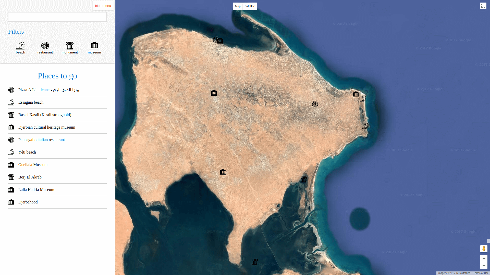

# Udacity's fsnd neighborhood map project!
A single page web app built with knockoutjs and google maps javascript API.



## Project structure

directory  | Description
 ---- | -----------
`src/viewmodels.js` | knockoutjs viewmodels logic.
`src/models.js` | models used by the viewmodel and the service.
`src/service.js` | all the google map and other API interactions.
`src/helpers.js` | utility functions.
`src/assets` | contains stylesheets and icons..

## Usage  

```
git clone https://github.com/HassenPy/udacity-fsnd-neighborhood-map-project  
npm install
npm start
```  

## References:  
### icons:  
https://www.smashingmagazine.com/2016/04/freebie-hotel-spa-55-icons-png-svg/  
http://www.smashingmagazine.com/2014/12/23/freebie-tourism-travel-icon-set-100-icons-png-svg  
### google maps api:
https://developers.google.com/maps/documentation/javascript/reference  
### DOM manipulation:
http://youmightnotneedjquery.com/  

jmosouza's comment: https://github.com/arunisrael/angularjs-google-places/issues/18  
